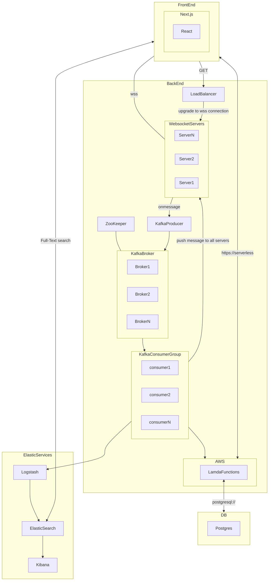

# TRPC Messenger with Kafka and HaProxy for Websocket Scaling

```mermaid
flowchart TD;
    subgraph FrontEnd
      subgraph Next.js
        React
      end
      
    end
    
    subgraph DB
      Postgres
    end
    
    subgraph BackEnd
      LoadBalancer
      subgraph AWS
        LamdaFunctions
      end
      WebsocketServers
      KafkaProducer
      subgraph KafkaConsumerGroup
        consumer1
        consumer2
        consumerN
      end  
      subgraph KafkaBroker
        Broker1
        Broker2
        BrokerN
      end 
      ZooKeeper---KafkaBroker
    end
    
    FrontEnd----|wss|WebsocketServers    
    FrontEnd-->|GET|LoadBalancer;
    FrontEnd<-->|Full-Text search|ElasticSearch


    subgraph WebsocketServers
    subgraph Server1
    KafkaProducer
    end    
    subgraph Server2
    KafkaProducer
    end    
    subgraph ServerN
    KafkaProducer
    end
    end
     LoadBalancer-->|upgrade to wss connection|WebsocketServers
    WebsocketServers --> |onmessage|KafkaProducer    
    KafkaProducer-->KafkaBroker

    
  
    
    KafkaBroker-->KafkaConsumerGroup
    
    subgraph ElasticServices
    Logstash
    ElasticSearch
    Kibana
    end
    
    KafkaConsumerGroup-->|push message to all servers|WebsocketServers
    KafkaConsumerGroup-->AWS
    KafkaConsumerGroup-->Logstash
    Logstash-->ElasticSearch
    ElasticSearch-->Kibana
    FrontEnd<-->|https://serverless|AWS
    LamdaFunctions<-->|postgresql://|DB
   
   
    

```
